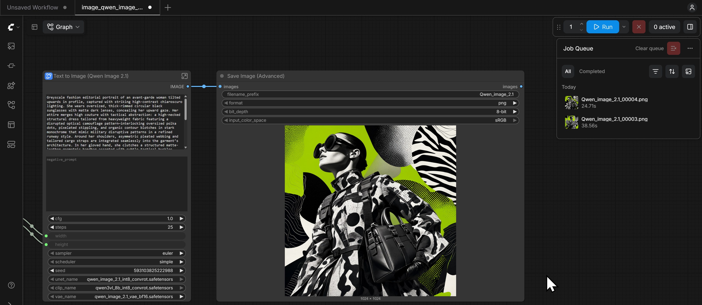

# Qwen-Image-2.1 ROCm Fast Path



Qwen-Image-2.1 text-to-image workflow for AMD Radeon PRO W7900D (`gfx1100`), packaged as a standalone ComfyUI image. This repository keeps only the fastest validated implementation: INT8 attention plus fused RMSNorm/RoPE in a pinned comfy-kitchen HIP extension, with a ComfyUI dispatcher that always selects the candidate attention path for supported calls.

On one W7900D, the isolated warm seed-44 run improved from **32.718921 s to 24.981790 s** end to end (`1.30971x`). KSampler improved from **31.302260 s to 23.600188 s** (`1.32636x`). See [benchmarks/W7900D.md](benchmarks/W7900D.md) for scope and correctness evidence.

A clean image built from this repository reproduced the same path at **25.064687 s** end to end on another isolated W7900D, with pixel-identical decoded RGBA output.

## What is included

- ComfyUI commit `d158420950922dde49dad1fa87fa549735fd5137`.
- ROCm/PyTorch base image digest `sha256:4449f856...` (ROCm 7.2.4, PyTorch 2.10.0).
- comfy-kitchen `0.2.35`, source commit `b2a2972ac68c395bbda8ad9030e8ae1089287815`.
- Accepted HIP sources in `kernels/` and the exact validated `gfx1100` extension in `artifacts/`.
- ComfyUI UI workflow and the exact API graph used for the 24.98 s measurement.
- Raw W7900D A/B and micro-oracle evidence in `benchmarks/raw/`.
- Model revision, sizes, and SHA-256 values in `models/manifest.json`; weights are downloaded locally and are not committed.

The image uses the validated binary by default because its SHA-256 is part of the evidence chain. `scripts/rebuild-extension.sh` recompiles the same sources for audit or porting, but linker/build metadata can make a source rebuild byte-different.

## Requirements

- Linux x86-64 with Docker.
- AMD Radeon PRO W7900D or another `gfx1100` GPU with at least 32 GB available VRAM.
- Host ROCm device access through `/dev/kfd` and `/dev/dri`.
- `rocm-smi`, `ss`, about 17.3 GB for model weights, and additional Docker storage.

The performance result is validated only for W7900D, ROCm 7.2.4, PyTorch 2.10.0, Python 3.12, and the pinned source/package revisions above.

## Quick start

```bash
cd ~/bigssd/github_project/Qwen-Image-2.1-Rocm
scripts/build.sh
scripts/download-models.sh
GPU_INDEX=0 HOST_PORT=28188 scripts/start.sh
```

ComfyUI is then available at `http://127.0.0.1:28188`. The workflow is installed as `qwen_image_2_1_t2i_fast.json` in the ComfyUI workflow menu.

Stop the standalone instance with `scripts/stop.sh`.

Verify that the accelerated runtime is active:

```bash
scripts/status.sh
```

The command requires all of the following: one logical GPU in the container, candidate dispatcher mode, comfy-kitchen attention availability, both optimized symbols, and extension SHA `0328285d...`.

Generate one image with the fixed graph:

```bash
SEED=44 RUN_NAME=my-run scripts/run-t2i.sh
```

Outputs are written under `output/qwen_image_2_1_rocm_fast/`; structured timing JSON is stored under `runtime/<container>/user/results/`.

## Reproduce the W7900D measurement

Use an otherwise idle W7900D. `start.sh` rejects a GPU above 256 MiB VRAM use or 5% utilization at startup.

```bash
GPU_INDEX=0 HOST_PORT=28188 scripts/start.sh
scripts/benchmark.sh
```

`benchmark.sh` first restarts the container to clear ComfyUI's in-memory graph cache, then follows the validated sequence: seed 43 warmup and seed 44 measurement with no prompt suffix. It requires the same six invariant nodes to be cached while KSampler, VAE decode, and image save execute; it also verifies the embedded extension and candidate calls, then writes `latest-summary.json` into the runtime result directory. Timing varies with clocks, thermals, host load, and model cache state; compare the recorded methodology, not only the final decimal places.

## Image artifact

The built image is `qwen-image-2.1-rocm:w7900d-fast`. Export it locally when a transferable Docker archive is needed:

```bash
scripts/export-image.sh
```

This creates `dist/qwen-image-2.1-rocm-w7900d-fast.tar` plus a SHA-256 file. `dist/` is intentionally ignored because the archive is multi-gigabyte. Load it elsewhere with:

```bash
docker load --input dist/qwen-image-2.1-rocm-w7900d-fast.tar
```

## Source rebuild

```bash
scripts/rebuild-extension.sh
```

The script expands the pinned comfy-kitchen source archive, installs the two accepted HIP files at their upstream paths, and builds only `gfx1100`. Do not use the prebuilt extension with another ROCm, Python ABI, comfy-kitchen revision, or GPU architecture; rebuild and rerun the micro oracles instead.

## Repository layout

- `Dockerfile`: standalone runtime image.
- `artifacts/`: exact validated comfy-kitchen HIP extension.
- `kernels/`: fastest accepted attention and RMSNorm/RoPE sources.
- `custom_nodes/`: ComfyUI dispatcher and status endpoint.
- `workflows/`: UI workflow and benchmark API graph.
- `scripts/`: build, model download, launch, health, generation, benchmark, rebuild, and export commands.
- `benchmarks/`: W7900D report and raw evidence.
- `vendor/`: pinned ComfyUI/comfy-kitchen sources and build wheels.

## Security and scope

The service binds to `127.0.0.1` because ComfyUI is unauthenticated. Use an SSH tunnel for remote access; do not expose port 8188/28188 publicly. No model token is stored by this project. ModelScope public download is used at the pinned revision.

See [THIRD_PARTY.md](THIRD_PARTY.md) for upstream projects and licenses.
